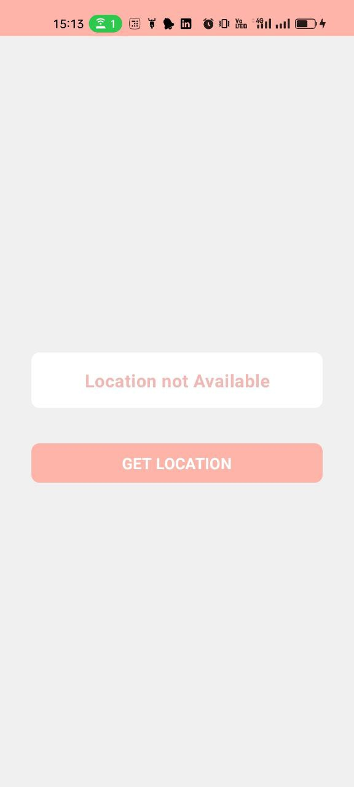
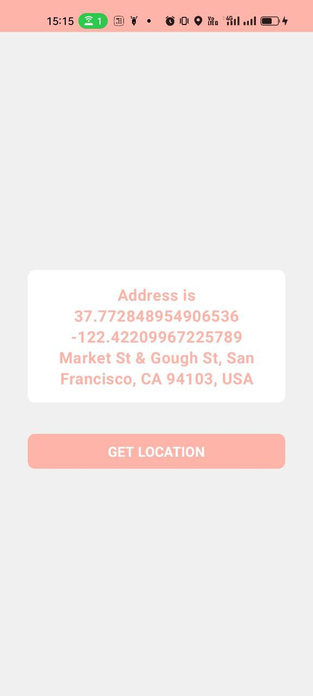

# LocationApp

LocationApp is an Android application that demonstrates how to request and display the user's current location using Jetpack Compose and modern Android development practices.

## Features

- Request location permissions at runtime
- Display the user's current location coordinates
- Reverse geocode coordinates to get a human-readable address
- Beautiful and modern UI using Jetpack Compose

## Screenshots

